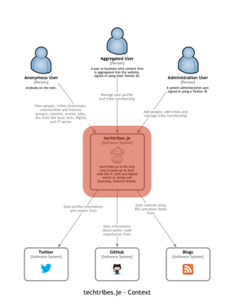
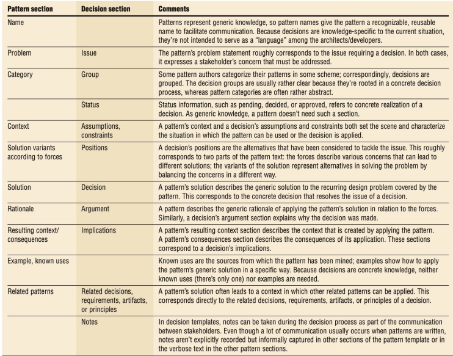
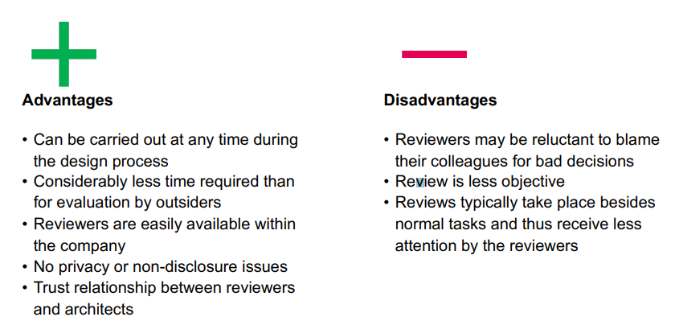

# Samenvatting SWA toets 2 (S_Toets2)
## Competenties
- Kent de concepten van de ISO 42010 standaard en verschillende invullingen van die standaard zoals 4+1 en C4 inclusief hun voor- en nadelen.
- Identificeert potentiële risico's door onderdelen uit het Framework for Architecture Decisions toe te passen en architecturele beslissingen te beschrijven.
- Evalueert de onderbouwing voor de keuze van patterns en tactics.
- Evalueert de onderbouwing voor keuzes voor COTS-oplossingen en frameworks.
- Kent verschillende architectuurevaluatiemethoden zoals ATAM en DCAR en kan de voordelen en nadelen van dergelijke methoden benoemen.

## ISO 42010
- Standaard voor architecture frameworks
- Stelt dat de software beschrijving verschillende stakeholder concerns moet adresseren.
- De software beschrijving wordt opgedeeld in verschillende views die een of meer stakeholder concerns adresseren.
- De 'rationale', dus de beslissingen moeten worden gedocumenteerd, en waarom ze zijn genomen.

### ISO 42010 concepten
- Stakeholder: Een persoon of origanisatie dat de requirements van een systeem gebruikt, of op wie het systeem impact heeft.
- Concern: Een interesse in het systeem die belangrijk is voor een of meer van de stakeholders. Een concern heeft meestal invloed op
  het systeem en zijn omgeving.
- Viewpoint: Beschrijft hoe specifieke stakeholder concerns worden geadresseerd.
- Modelkind: Het type modelleren wat gebruikt is.

## 4 + 1 view model framework
4 + 1 is een architectuur framework dat zich aan de ISO 42010 houd.

### Viewpoints
Het model bestaat uit 5 "viewpoints" die ieder het softwaresysteem vanuit hun view beschrijven.
- Elke viewpoint adresseert andere stakeholder concerns
- 4 + 1 is generic in het kader van gebruikte tools en notaties in de viewpoints. Dit betekent dat elke tool en notatiemethode te gebruiken is in het 4 + 1 view model. (UML of ISO 42010 is dus niet verplicht (wel handig om te gebruiken)!)

#### Logical view
- Focus ligt op functionele requirements
- Abstract overzicht van het systeem in termen van het problem domain.
- De modellen moeten het problem domain beschrijven, niet het systeem.
- Domeinmodellen en package diagrammen zijn goed toe te gebruiken.
- De eind-gebruiker is de belangrijkste stakeholder.

#### Development view (Ook bekend als implementation view)
- Focus ligt op software module organisatie
- Software wordt opgedeeld in kleine stukken die door een ontwikkelaar kunnen worden gemaakt.
- Layers, libraries, frameworks en components zijn terug te zien.
- De programmeurs zijn de belangrijkste stakeholders.

#### Process view
- Dynamische onderdelen van de software
- Gaat bijvoorbeeld over performance, availability, scalability, en fault tolerance.
- Beschrijft dynamics in de software (volgorde, concurrency, berichten tussen components)
- De volgende diagrammen zie je terug:
    - sequence
    - activity
    - state
    - timing
- Belangrijkste stakeholder is de integrator. 

#### Physical view
- Focus ligt op availability, reliability(fault tolerance), performance(throughput), en schaalbaarheid.
- Software wordt vaak op een netwerk van computers (aka "Nodes") deployed.
- De volgende dingen zie je vaak terug:
    - Staging servers voor development en testen.
    - Productie servers.
    - Clusters, load balancers, en proxies.
- Deployment diagrammen worden hier gebruikt, maar ook non-UML diagrammen over deployment kunnen gebruikt worden.
- Protocollen die de Nodes gebruiken worden gedefinieerd.
- Belangrijkste stakeholder is system engineer.

#### Scenarios
- Kleine set van use cases en QAS's die de relatie tussen de views beschrijft.
- Hoe de use case naar de verschillende views wordt "gemapt".

## C4
C4 is een architectuur framework dat alleen een focus op de implementatie/development legt. Het laat niet het design van de software zien.
In agile software development heeft dit grote nadelen. Je moet een goed idee van de architectuur hebben om agile te kunnen werken.
C4 bestaat uit 4 soorten diagrammen: Systeem(context), Containers, components, classes(of code). De diagrammen 
zijn niet in overeenstemming met de UML-standaard. 

### System
High-level diagram dat key system dependencies laat zien en actors.

### Container
Laat de high-level keuzes van technologieën, hoe de responsibilities zijn verdeeld, en hoe de containers communiceren.

### Component
Voor elke container laat een component diagram zien uit welke key components deze bestaat en hun relaties.

### Class (optional)
Een class diagram die de key components toelicht. Niet alle details hoeven hierin worden opgenomen, maar het moet consistent zijn en syntactisch.

## Architecture decisions
### Framework for architecture decisions
Dit framework is in overeenstemming met de ISO 42010 standaard. Het beschrijft hoe architecturele decisions worden vastgelegd.

#### Decision detail viewpoint (Decision rationale)

- Name: A short name of the decision that serves as a key in the
other views.
- Current state: The current state of the decision. Please refer to
Fig. C.3 for a list of all possible decision states.
- Decision groups: A decision can be associated to one or more
groups, which share specific characteristics. Decisions could for
instance be grouped by subsystem, architecture team who made
the decision, or quality attribute requirements. The concept of a
decision group is equal to the group concept in Tyree and Akerman’s decision template (Tyree and Akerman, 2005), and the
decision categories in Kruchten’s ontology (Kruchten, 2004).
- Problem/issue: The circumstances under which the architectfelt
the need to make a decision among one or more alternatives. In
other words, the issue addressed by the decision.
- Decision: The outcome of the decision. In other templates this
element is called solution.
- Alternatives: The alternative solutions considered when making
the decision.
- Related decisions: All decisions that have a relationship to the
decision. The available relationship types are defined inAppendix
C.2.
- Related system concerns: The term system concern is taken
from ISO/IEC/IEEE 42010, (ISO, 2011), describing any interest in
a system on behalf of its stakeholders. System concerns include,
among others: functional and non-functional requirements, constraints, business goals, assumptions, risks, and design rules. The
Decision Detail viewpoint is currently the only viewpoint that
allows one to trace requirements and architecture decisions. An
additional viewpoint that specializes on traceability between
requirements and decisions will be discussed in Section 6.
- History: The history of the described decision. The history contains all state changes, i.e., when the decision was proposed,
decided, approved and so on.
  
#### Decision relationship view

#### Chronoligcal view
Om een cronolighsche view te maken, moet je de volgende stappen doornemen:
- Documenteer eerst je milestones, zoals:
  - Een software release
  - Architecture review
  - Belangrijke vergadering
  - Een nieuwe versie van de architectuur
- Plak de datum aan de milestones
- Plak de decisions aan de milestones van de relationship view
- Corrigeer iedere iteratie de voglorde van decisions
- Remember the decision evolution

#### Stakeholder involvement view
Voor alle milestones in de chronologische view:
- Som alle decisions op die tot de milestone leidden
- Link alle decisions met minstens een stakeholder
  - Voeg de rol toe van de stakeholder
  - Beschrijf wat de stakeholders met de decision deden
- Confirm het met de sh als het mogelijk is
  

### Patterns
Beschrijf deze ook in de detail viewpoint.

## ATAM
ATAM kan door outsiders of peers worden gedaan.

### Peer

### Outsiders

### Analysis

- Sensitivity point: Een eigenschap van een of meer componenten die essentieel is om een QA response te bereiken.
- Tradeoff point: Een eigenschap dat invloed heeft op meer dan een attribuut. Een tradeoff point is een sensitivity point voor meer dan een QA.

## DECAR

